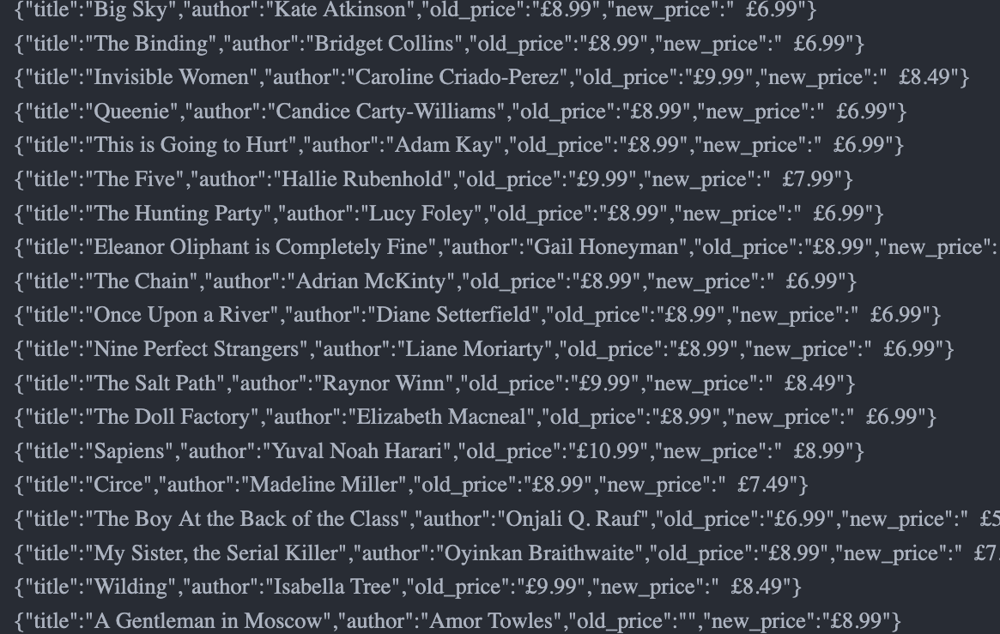

# webscraper-capstone-project

# What it does

The web scraper program collects data about the books of the month from the web site of a book store. It creates a text file, showing the details of the books of the month.

 Details of the books collected inlcudes:

- Title
- Author
- Old Price
- New Price

## Screenshot

## Built With

- Ruby

## Getting Started
You may use the following steps to get a local copy:

Clone project to your local machine
cd to the project directory
Open project in IDE/Text Editor
gem install nokogiri
gem install rspec
Type ruby main.rb through the terminal to run the code

## 🤝 Contributing
You are welcome to make contributions to the repository. Contributions may be made through issues comments and feature requests.

## 👤 Author

# Calvin
- GitHub [@calvinoea](https://github.com/calvinoea/)
- Twitter: [@yasukeoz](https://twitter.com/yasukeoz)
- LinkedIn: [Calvin](https://www.linkedin.com/in/calvin-ebun-amu-9b200017a/)

## Show your support
Give a ⭐️ if you like this project!

## 📝 License
This project is MiT licensed.